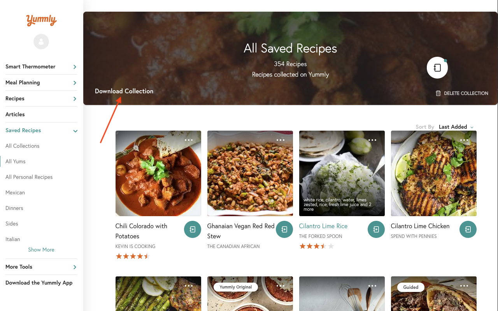

# Yummly Downloader Chrome Extension

This Chrome extension allows you to download/export your Yummly collections.
It adds a "Download Collection" button to the page, which will ensure all the data is loaded by auto-scrolling to the bottom of the page, then will prompt you to save the data file to your computer.

This JSON file contains all the data from you collection.
Note that you really only need to download the "All Yums" collection; it contains the list of collections each recipe is associated with.

Now that you have this file, you can reference it in any way you'd like, but the intented usage is to navigate to
(coming soon), where you can upload the file and browse your collection in web format, where you can print or share your recipes with another application.

### Local Installation
To install this extension locally (instead of through the Chrome Web Store):

1. [Click here](https://github.com/jsmartt/yummly_downloader_chrome/archive/refs/heads/main.zip) to download the code of this repo as a zip file. Save it anywhere you'd like.
2. Extract the zip file.
3. Go to `chrome://extensions/` and enable the "Developer mode" toggle in the top right corner.
4. Click the new "Load unpacked" button near the top left, and select the directory of the extracted files.
